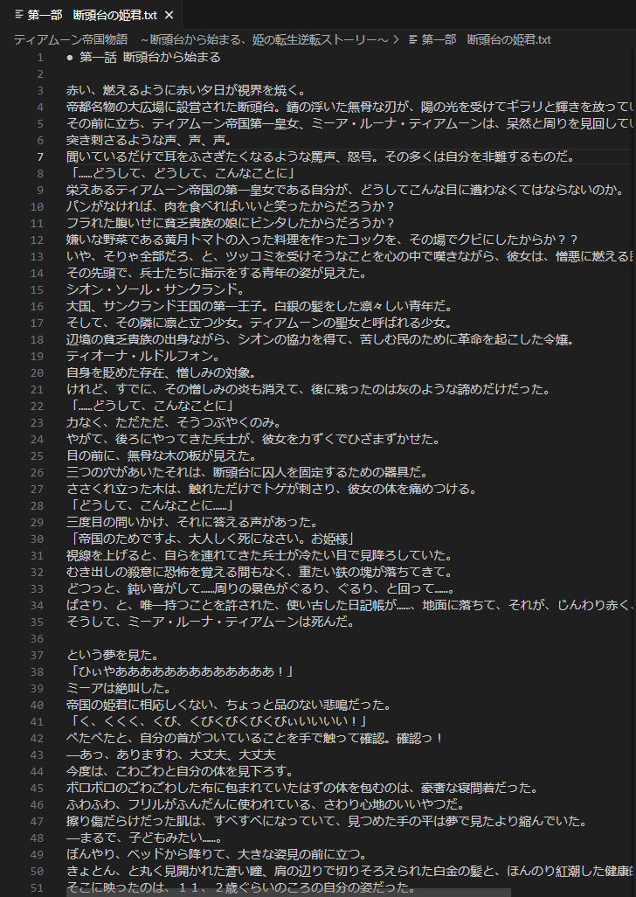
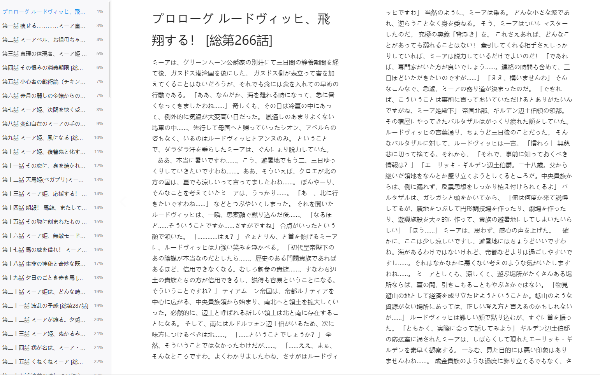

# syosetu novel downloader
A simple code for downloading novels from [syosetu.com](syosetu.com)
You can find examples under [examples](./examples)

## Usage
If you already installed [uv](https://github.com/astral-sh/uv)
```
uv sync
uv run mian.py --novel_id n4350im
```
otherwise
```
pip3 install -r requirements.txt
python3 mian.py --novel_id "n4350im"
```
### Supported parameters:
- `novel_id`:   
  The path of the novel on the website, similar to `n4350im` (https://ncode.syosetu.com/n4350im/)
- `proxy` (optional):  
  Depending on your region, you may need to configure `proxy` to access `syosetu.com`.
- `output-dir` (optional):  
  The path to save the novel. If not specified, the novel will be saved in the current directory.
- `save-format` (optional):  
  The format of the novel, now support `txt` amd `epub`. If not specified, the novel will be saved in `.txt` format.
- `record-chapter-number` (optional):  
  Whether to record the chapter number in the novel. If not specified, the chapter number will not be recorded. Like:  
  

## Examples:
`txt`  
  
`epub`  



# LICENSE
[MIT LICENSE](./LICENSE)